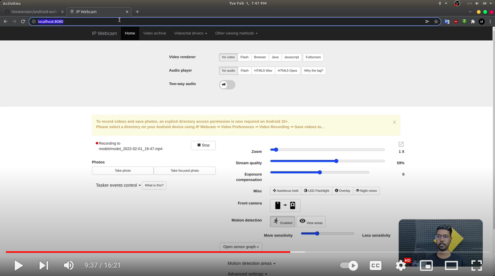
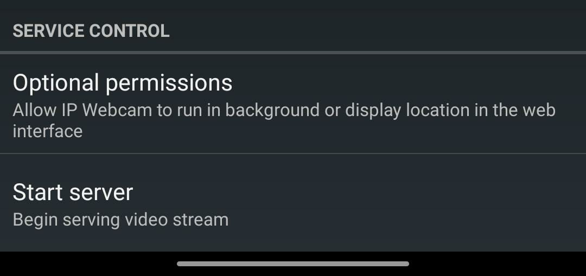
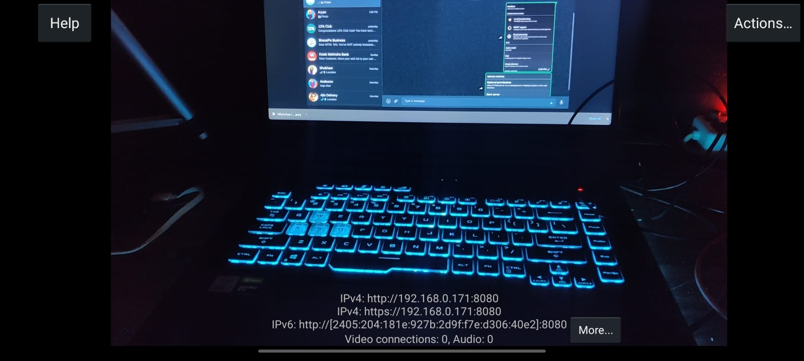
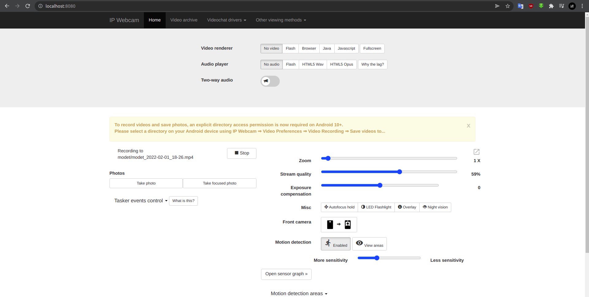
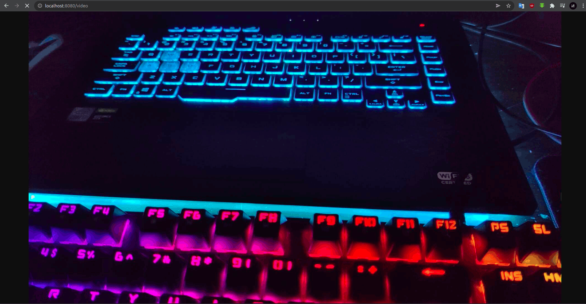
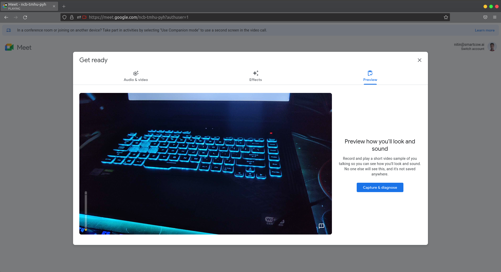

# Android Webcam (4K)

[](https://youtu.be/JZdKoet9-6o")


Having a laptop without decent webcam is like a nightmare for me, But fortunately  I happen to have an Android phone lying around hence I decided to use it as my `4K USB Webcam`.

>  This guide is focused for Linux users.

### Prerequisites

- Android phone
- USB cable
- Ubuntu 18.04+

### Setting up your PC

1. Install [scrcpy](https://github.com/Genymobile/scrcpy) so that we can mirror android screen and access it from our PC, this would be very helpful when the phone is attached on some tripod and stand facing back camera on to our face.

   ````
   sudo apt update -y
   sudo apt install scrcpy -y
   ````

   If the above method doesn't works you can either build it from source or use snap store to install it as well.

2. Install [ffmpeg](https://ffmpeg.org/), this would be needed to publish received camera stream to a virtual camera on Linux system

   ````
   sudo apt install ffmpeg -y
   ````

3. Install ADB tools, this is used for port forwarding from android device to your PC.

   ````
   sudo apt install android-tools-adb -y
   ````
   
4. Install [v4l2loopback](https://github.com/umlaeute/v4l2loopback) this will be used to create virtual camera

   ```
   git clone https://github.com/umlaeute/v4l2loopback
   cd v4l2loopback
   make && sudo make install
   sudo depmod -a
   sudo modprobe v4l2loopback
   ```

### Setting up your Android phone

1. Open up `Developer options` inside your Android settings and turn on `USB Debugging`.
2. Make sure the phone is connected via USB cable to your computer.
3. Install [ipwebcam](https://play.google.com/store/apps/details?id=com.pas.webcam&hl=en_IN&gl=US) android app on your phone, the play store version is bloated with google ads hence you can download pro version from [here](asset/com.pas.webcam.pro-7685.apk)

### Steps to use the camera over USB

Before moving forward make sure your phone is connected to your pc via USB cable and usb debugging is enabled.

1. Open the `ipwebcam` application on your android phone, scroll all the way down and click `Start server`.

   

2. You will be able to see `IPv4` address at the bottom of the screen.

   

3. Setup port forwarding from your phone to your pc via adb-manager to access the camera:

   - Open a terminal and scan for available devices

     ```sh
     adb devices -l
     ```

     Output:

     ````sh
     List of devices attached
     afbbb41a               device usb:1-5.1 product:OnePlus8_IND model:IN2011 device:OnePlus8 transport_id:2
     ````

   - Export the device serial number in your terminal, this step is done so that if you have multiple devices attached to your system adb will not be confused

     ````
     export ANDROID_SERIAL=afbbb41a
     ````

   - Start port forwarding from android device to your pc

     ````
     adb forward tcp:8080 tcp:8080
     ````

     > First port indicates port on host machine second port shows port on which ipwebcam is running on your android phone.

   - Now if you visit http://localhost:8080/ on your pc, you should be able to see the ipwebcam interface.

     

   - Similarly you can visit  http://localhost:8080/video to see the actual video stream

     

   - Now that we have access to the video stream in the browser we can redirect this stream to a virtual camera device using v4l2loopback we installed earlier.

     ```
     sudo ffmpeg -i http://localhost:8080/video -vf format=yuv420p -f v4l2 /dev/video0
     ```

   - Now our virtual camera is ready you can use it with any online meeting application / obs-studio / OpenCV applications.

     > Note:- Camera will not be visible in google chrome, please use firefox browser

     

**Bonus**

- As this entire workflow requires a lot of steps to follow beginning from starting the ipwebcam application on you android, port forwarding and v4l2loopback

- I created a script to automate all these steps, you just need to plug your phone via USB to the pc and rest all can be handled by the script.

  ````sh
  chmod +x ipwebcam.sh
  sudo ./ipwebcam.sh -f
  ````
  
  > Note:- don't forget to update the **ANDROID_SERIAL** inside the script.
